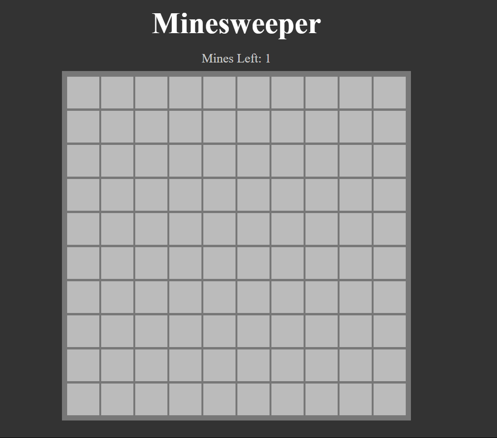
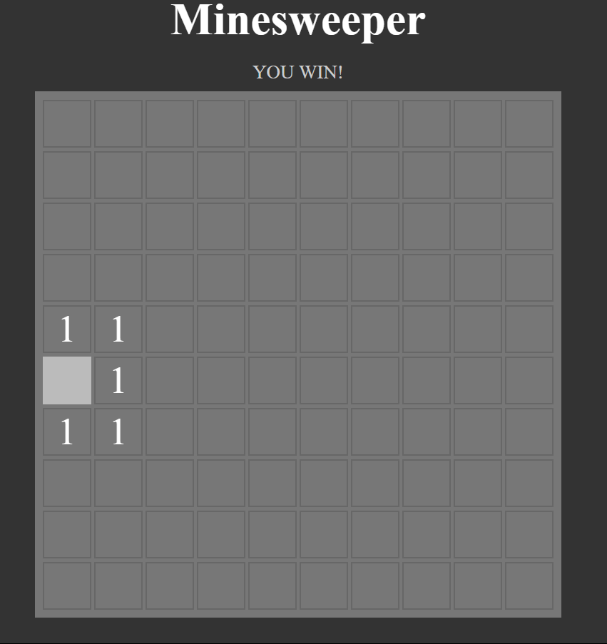

# Minesweeper Game
This is a basic implementation of the classic Minesweeper game.

# Purpose
Just to learn by building

# How to Access

# Clone the repository:

 command: `git clone git@github.com:hemantch01/minesweeper-Game.git`

# Navigate to the project directory:

command: `cd minesweeper-Game`

# Open in Browser:
 Simply open the index.html file in browser using Live Server.

